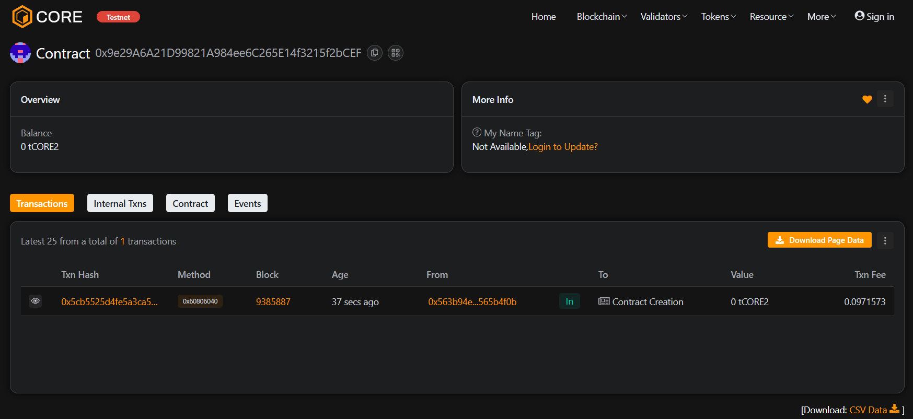

# ⚙️ DeNodeOne

### Project Description
**DeNodeOne** is a decentralized node registration and management platform that allows users to create and manage blockchain nodes using smart contracts.  
Users can register nodes by staking ETH, deactivate them anytime, and administrators can manage ownership securely — all without centralized intermediaries.

---

### 🌍 Project Vision
To create a **trustless and decentralized node infrastructure layer**, where network participants can easily onboard, stake, and operate blockchain nodes transparently and autonomously.

---

### ⚡ Key Features
- **Node Registration:** Users can register nodes by staking ETH.  
- **Stake Refund:** Nodes can be deactivated, refunding the staked amount.  
- **Admin Controls:** Secure admin ownership transfer functionality.  
- **Fully On-chain:** All operations are recorded immutably on Ethereum.

---

### 🚀 Future Scope
- Integration with staking pools for shared node ownership.  
- Multi-chain compatibility (Polygon, BSC, Avalanche).  
- Integration with IPFS for node metadata.  
- Governance-based node rewards.  
- Node health verification via oracle networks.

---

### 🧰 Tech Stack
- **Solidity** – Smart contract language  
- **Hardhat** – Development and testing framework  
- **JavaScript** – For deployment and testing scripts  
- **Ethereum / Sepolia Testnet**

---

### 🪄 Commands

```bash
# Install dependencies
npm install

# Compile contracts
npx hardhat compile

# Run tests
npx hardhat test

# Deploy to Sepolia testnet
npx hardhat run scripts/deploy.js --network sepolia


contract detail : 0x9e29A6A21D99821A984ee6C265E14f3215f2bCEF
